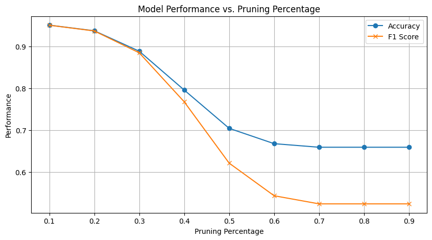
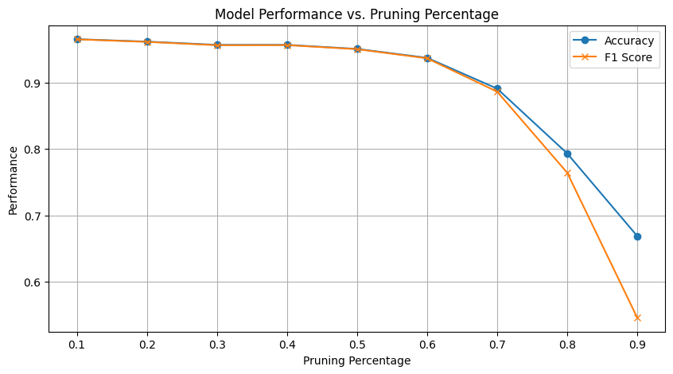
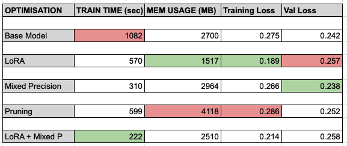

# LLM Optimization

This repository contains my work on optimizing Large Language Models (LLMs), focusing on improving efficiency, reducing computational load, and making fine-tuning more accessible for diverse applications. Below is an outline of the contents and goals of each component.

## Contents

### 1. Presentations
- **[LLM_arch.pdf](LLM_arch.pdf)**: An introductory presentation on LLM architecture, covering foundational concepts and architecture basics presented to my professor.
- **[LLM_Reqs.pdf](LLM_Reqs.pdf)**: A detailed presentation on the computational and memory constraints encountered when running LLMs. This presentation explores each stage of LLM inference (e.g., prefill and decoding) and introduces Roofline Models for analyzing performance.

### 2. Sparse Low-Rank Adaptation (LoRA)
- **LoRA Directory**: Contains code and resources for implementing LoRA with the Lottery Ticket Hypothesis. 

The goal of this project was to streamline and accelerate the fine-tuning process for LLMs, making it accessible even for those without high-end hardware. By optimizing the LoRA (Low-Rank Adaptation) method, I aimed to reduce the computational demands of fine-tuning while maintaining model accuracy. This work intends to help researchers and developers quickly adapt LLMs to specific tasks, facilitating real-world applications without requiring extensive computational resources.

#### My findings
Pruning LoRA weights **randomly** :

Pruning LoRA by magnitude (lowest first) :

We can see from my findings that, pruning weights randomly does not work nearly as well as if we pruned them according to decreasing order of magnitude.

### 3. Testing Computation and Memory Bounds
- **Testing_bounds/RoBERTa_ft**: A directory for experiments focused on measuring the computation and memory requirements of various fine-tuning techniques, particularly with RoBERTa.

This ongoing project investigates the computational and memory limits associated with LLM tasks such as inference, training, and fine-tuning. I am experimenting with different fine-tuning methods to evaluate their efficiency and explore ways to alleviate hardware constraints.

#### My findings

### 4. Cost Modelling the Fine-Tuning Task
- **Cost_modelling/LLM_ft_setup**: This project is an ongoing research effort to compare different fine-tuning strategies for large language models under equal time and cost constraints.
Currently, it supports experiments with full fine-tuning and LoRA-based fine-tuning on the IMDb sentiment classification task using distilbert-base-uncased.
  - **Key features:**
Tracks training time, memory usage (CPU/GPU), and evaluation accuracy
Uses Weights & Biases (wandb) for experiment logging and comparison
Provides a cost extrapolation table based on cloud GPU pricing
Further development will include support for QLoRA, more tasks, and deeper analyses across models and hardware.
- **Cost_modelling/HP_tuning**: This notebook benchmarks different hyperparameter tuning algorithms (e.g. grid search, random search, Optuna) to evaluate which method finds optimal fine-tuning parameters most efficiently. The main goal is to track convergence speed. This notebook benchmarks different hyperparameter tuning algorithms (e.g. grid search, random search, Optuna) to evaluate which method finds optimal fine-tuning parameters most efficiently.